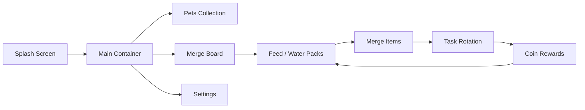

# Merge Game

[](https://flutter.dev/)
[](./web/)
[](./RELEASE_NOTES.md)

> A Flutter merge-board prototype that mixes pet collection, task progression, resource loops, and GitHub Pages delivery.

## Release Highlights

- Release-focused README refresh with a GitHub-safe visual overview
- GitHub Pages deployment workflow for Flutter Web
- Web metadata updated for a product-facing presentation
- Release notes prepared for GitHub release publishing

## Visual Overview



## What Ships In This Build

| Area | Included |
| --- | --- |
| Core loop | 9x7 merge board with level-based merge rules |
| Progression | Task rotation, rewards, pack cooldowns, resource loop |
| Screens | Splash, pets, home, settings placeholder, shop |
| Platforms | Android, iOS, Flutter Web |
| Delivery | GitHub Pages workflow + release notes |

## Quick Start

### Requirements

- Flutter SDK with Web support enabled
- Dart SDK compatible with the Flutter toolchain

### Install

```bash
flutter pub get
```

### Run locally

```bash
flutter run
```

### Run on Chrome

```bash
flutter config --enable-web
flutter run -d chrome
```

### Build for GitHub Pages

```bash
flutter build web --release --base-href /merge/
```

Use `/merge/` for this repository's current GitHub Pages path. If the repository is published as `username.github.io`, switch the base href to `/`.

## Repository Layout

```text
lib/
  main.dart                     # App entry and main merge gameplay screen
  main_container.dart           # Navigation shell
  widgets/merge_game_board.dart # Board interaction logic
  data/                         # Task data and repository
  services/                     # Coin, energy, board state
  screens/                      # Pets, shop, inbox, settings
web/                            # Flutter web shell and manifest
assets/                         # Game images, packs, pets, UI assets
```

## Deployment

The GitHub Pages workflow is defined in [`.github/workflows/deploy-github-pages.yml`](./.github/workflows/deploy-github-pages.yml).

1. Push to `main` or run the workflow manually.
2. GitHub Actions builds Flutter Web with a repo-aware `base-href`.
3. `build/web` is uploaded and deployed to GitHub Pages.

One-time GitHub setup:

1. Open `Settings > Pages`
2. Set the source to `GitHub Actions`

## Release Notes

The release summary for this iteration lives in [RELEASE_NOTES.md](./RELEASE_NOTES.md).

## Notes

- `spine_flutter` is initialized at app startup, so the web release should always be validated against the current Flutter toolchain before publishing.
- Firebase configuration files exist, but the current app entry does not initialize Firebase.
- Some screens still contain placeholder or mock behavior, especially settings and purchase handling.

## Key Files

- [`lib/main.dart`](./lib/main.dart)
- [`lib/main_container.dart`](./lib/main_container.dart)
- [`lib/widgets/merge_game_board.dart`](./lib/widgets/merge_game_board.dart)
- [`lib/data/board_task_repository.dart`](./lib/data/board_task_repository.dart)
- [`web/index.html`](./web/index.html)
- [`RELEASE_NOTES.md`](./RELEASE_NOTES.md)
